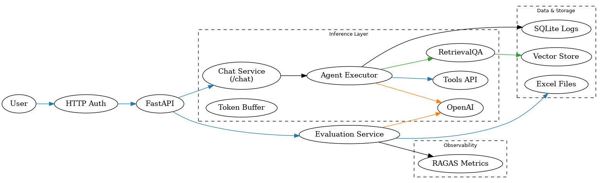

# AnchorTel – Gen‑AI Telecom Chatbot

A full‑stack customer‑support assistant that combines **retrieval‑augmented generation (RAG)** with task‑oriented tools **and an automatic evaluation pipeline**. Built with **FastAPI**, **LangChain / LangGraph**, **OpenAI GPT‑4o**, and packaged for **Docker → Google Cloud Run**.
<p align="center">
  
</p>
---

## 🔑 Key Features

| Theme                    | What it delivers                                                                                              |
| ------------------------ | ------------------------------------------------------------------------------------------------------------- |
| **RAG‑grounded answers** | Vector store anchors every response in AnchorTel docs; sources optionally returned.                           |
| **Tool invocation**      | Secure APIs let the agent create accounts, reset passwords, and pull billing info—directly from chat.         |
| **Session memory**       | Token buffer (\~2 000 tokens) enables multi‑turn support without losing context.                              |
| **Automatic evaluation** | One‑click Excel workflow: generate reference Q&A, upload edits, and receive five **LLM‑based RAGAS metrics**. |
| **Observability & logs** | OpenTelemetry traces + SQLite log of unanswered queries for continuous improvement.                           |
| **Cloud‑ready**          | Single Docker image or Cloud Run deployment; .env‑driven secrets.                                             |

---

## 📁 Project Structure

```text
anchortel/
├── backend/
│   ├── main.py          # FastAPI entry (chat + eval)
│   ├── agent_logic.py   # LangChain agent + tools + memory
│   ├── evaluation.py    # Question generator & RAGAS scorer
│   ├── rag_store.py     # Vector store wrapper
│   ├── tools.py         # account / billing actions
│   ├── initialize_db.py # SQLite for unhandled queries
│   └── Dockerfile
├── frontend/
│   ├── public/          # static HTML/CSS/JS
│   └── Dockerfile
└── images/
    ├── anchortel_chatbot_arch_enhanced.png
 

---

## 🛠️ Technologies

- FastAPI   ·  LangChain / LangGraph 0.4.8   ·  OpenAI GPT‑4o
- FAISS / Chroma vector store   ·  RAGAS metrics
- Docker   ·  Google Cloud Run   ·  Python 3.10

---

## ⚙️ Backend Setup

```bash
cd backend
python -m venv venv && source venv/bin/activate
pip install -r requirements.txt
cp .env.example .env  # add OPENAI_API_KEY
uvicorn main:app --reload --port 8080
```

### Cloud Run

```bash
make build   # docker build -t gcr.io/<project>/anchortel-backend .
make deploy  # gcloud run deploy …
```

---

## 🖥️ Frontend Setup

```bash
cd frontend/public
npx http-server . -p 8080
```

Dockerized deployment:

```bash
cd frontend && make build && make deploy
```

---

## 🔌 API Endpoints

| Endpoint              | Method      | Purpose                                   |
| --------------------- | ----------- | ----------------------------------------- |
| `/chat`               | POST        | Main chatbot interface                    |
| `/generate-questions` | POST        | Auto‑create *n* reference Q&A rows        |
| `/evaluate-excel`     | POST (file) | Upload workbook → returns scored workbook |
| `/test`               | GET         | Health check                              |

---

## 📊 Automatic Evaluation Workflow

1. **Generate** – `POST /generate-questions?n=25` → receive **questions.xlsx** with blank *Answer* column.
2. **Curate** – SMEs tweak reference answers and questions directly in Excel.
3. **Evaluate** – upload the sheet to `POST /evaluate-excel`.
4. **Metrics** – backend computes faithfulness, context‑precision, context‑recall, answer‑relevancy, answer‑similarity via RAGAS.
5. **Download** – get **evaluated.xlsx** ready for reporting.

---

## 📐 UML Sequence (Mermaid)

```mermaid
sequenceDiagram
    autonumber

    %% PARTICIPANTS
    participant User
    participant FastAPI
    participant ChatSvc  as Chat_Service
    participant EvalSvc  as Evaluation_Service
    participant Agent
    participant RAG
    participant VectorDB
    participant OpenAI
    participant RAGAS
    participant Excel

    %% ---------- 1. CHAT ROUND-TRIP ----------
    User ->> FastAPI: POST /chat {query}
    FastAPI ->> ChatSvc: forward
    ChatSvc ->> Agent: handle_query()
    Agent ->> RAG: retrieve(query)
    RAG ->> VectorDB: similarity_search
    VectorDB -->> RAG: docs
    RAG -->> Agent: context
    Agent ->> OpenAI: completion(prompt+context)
    OpenAI -->> Agent: answer
    Agent -->> ChatSvc: {answer, sources}
    ChatSvc -->> FastAPI: response
    FastAPI -->> User: JSON

    %% ---------- 2. GENERATE TEST Q&A ----------
    User ->> FastAPI: POST /generate-questions
    FastAPI ->> EvalSvc: forward
    EvalSvc ->> OpenAI: generate n Q&A
    OpenAI -->> EvalSvc: list[Q,A]
    EvalSvc ->> Excel: create questions.xlsx
    EvalSvc -->> FastAPI: download link
    FastAPI -->> User: Excel URL

    %% ---------- 3. EVALUATE EXCEL ----------
    User ->> FastAPI: POST /evaluate-excel
    FastAPI ->> EvalSvc: file stream
    EvalSvc ->> OpenAI: LLM answers per Q
    OpenAI -->> EvalSvc: answers
    EvalSvc ->> RAGAS: compute metrics
    RAGAS ->> OpenAI: sub-eval calls
    OpenAI -->> RAGAS: scores
    RAGAS -->> EvalSvc: metrics table
    EvalSvc ->> Excel: append → evaluated.xlsx
    EvalSvc -->> FastAPI: download link
    FastAPI -->> User: evaluated.xlsx

```



---

## 🛡️ Security Notes

- Secrets in `.env` (use Secret Manager in prod)
- Basic Auth & CORS for demo; swap to OAuth2 for production
- Rate‑limit evaluation endpoints to control token cost

---

## 🗺️ Roadmap

- CI/CD via GitHub Actions + Terraform
- Prometheus / Grafana latency & cost dashboards
- Outage‑credit & plan‑change tools
- Bedrock Titan fine‑tune for AnchorTel tone


    
